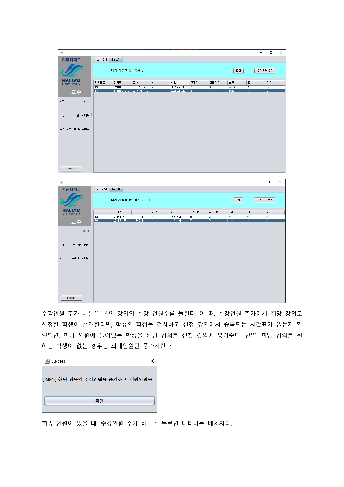

# Data_Communication_Project
데이터통신 프로젝트입니다. TCP/IP 소켓프로그래밍을 통한 수강신청 프로그램

### 기능상세설명

### 회원가입
{아이디, 비밀번호, 이름, 학년, 전공, 인증키, 권한}

### 로그인
{아이디, 비밀번호}

### 로그아웃

### 비밀번호찾기
{아이디, 비밀번호, 인증번호}

### 회원탈퇴

## 결과보고서

